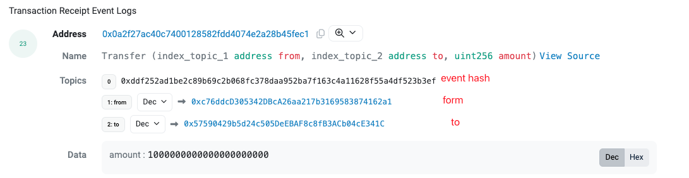

## eth 过滤日志

比如过滤USDT的交易日志
```go
opts := ethereum.FilterQuery{
		FromBlock: big.NewInt(start),
		ToBlock:   big.NewInt(end),
		Addresses: Addresses,
		Topics:    topics,
	}
```

- FromBlock: 起始区块
- ToBlock: 结束区块
- Addresses: 合约地址, []common.Address 可以同时过滤多个合约
- Topics: 事件主题, [][]common.Hash 可以同时过滤多个事件

### 事件主题
Topics 是一个二维数组, 

第一维是事件(event)的数组, 第二维是事件的参数索引数组，合约事件带index的参数

比如过滤 Transfer 事件



```go
    // 事件数组
	transferEvents := crypto.Keccak256Hash([]byte("Transfer(address,address,uint256)"))
    // 参数数组, 如果为空表示不过滤，会匹配所有的form
	forms := []common.Hash{common.HexToAddress("0xform1"), common.HexToAddress("0xform2")}
    // 参数数组, 如果为空表示不过滤，会匹配所有的to
	tos := []common.Hash{common.HexToAddress("0xto1"), common.HexToAddress("0xto2")}

    query := [][]interface{}{transferEvents, forms, tos}
	
    topics, err := abi.MakeTopics(query...)
    
	// 合约地址
	addresses := []common.Address{common.HexToAddress("0xcontract")}
    
	opts := ethereum.FilterQuery{
        FromBlock: big.NewInt(start),
        ToBlock:   big.NewInt(end),
        Addresses: addresses,
        Topics:    topics,
    }

    logs, err := ethClient.FilterLogs(ctx, opts)

```
